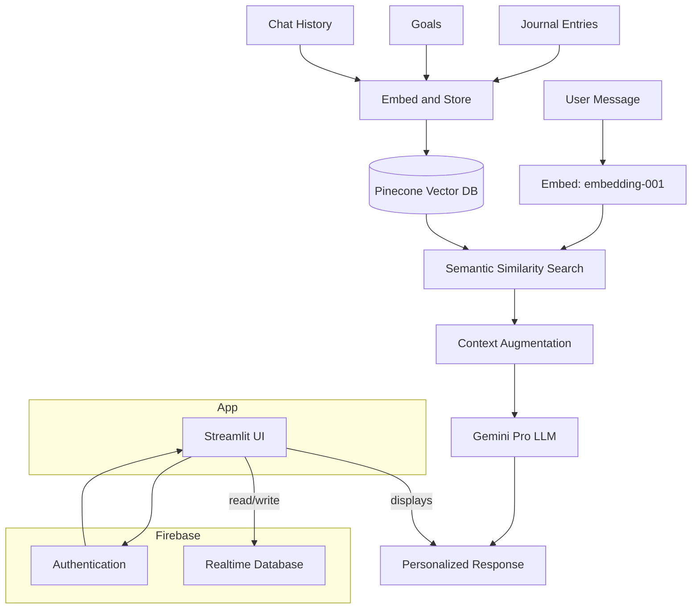

# MyMindMate – Your Personal AI Companion

<div align="center">

[](https://python.org)
[](https://streamlit.io)
[](https://deepmind.google/technologies/gemini/)
[](https://firebase.google.com)
[](https://www.pinecone.io)

</div>

MyMindMate is **your personal AI companion** designed to support mental wellness, organize your thoughts, and help you reach your goals.

I’ve always been someone who writes down my day, plans, and reflections in a notebook — so I wanted to bring that habit into the digital world. 

MyMindMate was born from this idea: **a space where you can write your journal, set personal goals, and build a connection with an AI that learns and grows with you 🌱** 

---

## 📚 Table of Contents
- [Core Features](#-core-features)
- [AI Architecture](#-ai-architecture-rag-flow)
- [Tech Stack](#️-tech-stack)
- [Setup](#️-setup--installation)
- [Usage](#-usage)
- [Contributing](#-contributing)
- [License](#-license)
- [Highlights](#-highlights)

---

## 🚀 Core Features

- **🧠 RAG-Enabled Memory:** MyMindMate uses a **Retrieval-Augmented Generation (RAG)** architecture to remember past conversations, journals, and goals — enabling a deeper, more personal, and contextually aware AI experience.
- **📘 Personal Journal:** Securely record your daily thoughts and reflections. These entries serve as one of the data sources that enrich the AI’s long-term memory.
- **🎯 Goal Management:** Set daily and long-term goals. The AI tracks and references these goals to provide proactive, goal-oriented support.
- **🤖 Personalized AI:** Continuously analyzes your journals and goals to understand you better and provide empathetic, meaningful, and tailored responses.
- **🔐 Secure & Private:** All data is securely stored using Firebase Authentication and Database. Your information is completely private and unique to you.

---

## 🤖 AI Architecture: RAG Flow

The intelligence behind MyMindMate goes beyond a standard LLM query. It uses a **Retrieval-Augmented Generation (RAG)** pattern to build a personalized, persistent memory for each user.

### System Architecture



### How It Works

1. **Data Sources & Embedding:**  
   User data such as chat messages, journal entries, and goals are converted into semantic embeddings using Google’s `embedding-001` model.

2. **Vector Storage:**  
   These embeddings, along with their source text, are stored in a **Pinecone** vector database — enabling high-speed semantic search and forming the AI’s “long-term memory.”

3. **Semantic Retrieval:**  
   When a new message is received, it’s also embedded and used to search Pinecone for the most contextually relevant memories or records.

4. **Context Augmentation:**  
   The retrieved memories are merged with the user’s current message to create an enriched context for the AI.

5. **Response Generation:**  
   This context is passed to **Google Gemini Pro**, which generates a thoughtful, personalized response that references your past inputs and goals.

This architecture allows MyMindMate to *truly know you*, becoming a smarter and more emotionally intelligent companion over time.

---

## 🛠️ Tech Stack

### Frontend & Backend
- **Framework:** [Streamlit](https://streamlit.io/) – fast and modern web app framework
- **Language:** [Python 3.8+](https://www.python.org/)

### AI & Machine Learning
- **Main LLM:** [Google Gemini Pro](https://deepmind.google/technologies/gemini/) – generates context-aware, personalized responses
- **Embedding Model:** [Google Generative Language embedding-001](https://ai.google.dev/docs/embeddings_guide) – transforms text into semantic embeddings

### Database & Storage
- **Authentication:** [Firebase Authentication](https://firebase.google.com/products/auth)
- **Structured Data:** [Firebase Realtime Database](https://firebase.google.com/products/realtime-database) – user profiles, journals, and goals
- **Vector Database:** [Pinecone](https://www.pinecone.io/) – the semantic search engine at the heart of the RAG system

---

## 📂 Project Structure

```
my_mindmate/
│── .streamlit/
│   └── config.toml
├── ai/
│   └── gemini_client.py
├── components/
│   └── sidebar_info.py
├── core/
│   ├── analysis_engine.py
│   ├── firebase_auth.py
│   ├── firebase_config.py
│   ├── firebase_db.py
│   └── memory.py
├── pages/
│   ├── 0_👋_Hoş_Geldin.py             # Welcome page
│   ├── 0_🔐_Kullanıcı_Girişi.py       # Login page
│   ├── 1_🏠_Ana_Sayfa.py              # Home page
│   ├── 2_💬_Sohbet.py                 # Chat page
│   ├── 3_📘_Günlüğüm.py               # Journal page
│   ├── 4_🎯_Hedeflerim.py             # Goals page
│   └── 5_⚙️_Ayarlar.py                # Settings page
├── utils/
│   ├── quotes.py
│   └── style.py
├── app.py
├── requirements.txt
└── README.md
```
*Note:* Each folder (`ai/`, `components/`, `core/`, `utils/`) contains an `__init__.py` file to maintain Python package integrity.

💡 Heads up! The current version of the codebase is written in Turkish. An English version is planned for future updates. The functionality and structure remain fully understandable regardless of language.

---

## ⚙️ Setup & Installation

### Prerequisites
- Python 3.8 or higher
- Git
- Google Cloud account (for Gemini API)
- Firebase account
- Pinecone account

### 1. Clone the Repository
```bash
git clone https://github.com/dilsahelmaci/MyMindMate.git
cd MyMindMate
```

### 2. Create and Activate a Virtual Environment
**Windows:**
```bash
python -m venv venv
venv\Scripts\activate
```
**macOS/Linux:**
```bash
python3 -m venv venv
source venv/bin/activate
```

### 3. Install Dependencies
```bash
pip install -r requirements.txt
```

### 4. Configure API Keys
Create a file named `secrets.toml` inside the `.streamlit` folder:

```bash
touch .streamlit/secrets.toml
```

Example template:
```toml
[google]
api_key = "YOUR_GEMINI_API_KEY"

[firebase]
apiKey = "YOUR_FIREBASE_API_KEY"
authDomain = "YOUR_PROJECT.firebaseapp.com"
projectId = "YOUR_PROJECT_ID"
storageBucket = "YOUR_PROJECT.appspot.com"
messagingSenderId = "YOUR_SENDER_ID"
appId = "YOUR_APP_ID"
databaseURL = "https://YOUR_PROJECT-default-rtdb.firebaseio.com/"

[pinecone]
api_key = "YOUR_PINECONE_API_KEY"
```

---

### 5. Obtain API Keys
<details>
<summary><b>🔑 Google Gemini API Key</b></summary>

1. Go to [Google AI Studio](https://makersuite.google.com/app/apikey)  
2. Click **Create API Key**  
3. Copy and paste your key into `secrets.toml`

</details>

<details>
<summary><b>🔥 Firebase Setup</b></summary>

1. Go to [Firebase Console](https://console.firebase.google.com/)  
2. Create a new project  
3. Enable Authentication and Realtime Database  
4. Get your configuration details from Project Settings > General

</details>

<details>
<summary><b>🌲 Pinecone Setup</b></summary>

1. Sign up at [Pinecone](https://www.pinecone.io/)  
2. Copy your API key  
3. *(Note: The index is automatically created — no manual setup required)*

</details>

---

### 6. Run the App
```bash
streamlit run app.py
```

---

## 🎯 Usage

### First-Time Setup
1. **Create an Account:** Sign up securely using Firebase Authentication.
2. **Set Up Your Profile:** Add preferences and personal info.
3. **Write Your First Journal Entry:** Help the AI understand you.
4. **Set Your Goals:** Define short-term and long-term objectives.

### Daily Usage
- **🌅 Morning:** Review your daily goals.
- **📝 During the Day:** Log your thoughts and feelings.
- **💭 Anytime:** Chat with your AI companion for motivation and reflection.
- **🌙 Evening:** Reflect on the day and plan tomorrow.

---

## 🤝 Contributing

MyMindMate is open source! Contributions are always welcome 💫

### How to Contribute
1. **Fork** the repository  
2. Create a new branch (`git checkout -b feature/NewFeature`)  
3. Commit your changes (`git commit -m 'Add new feature'`)  
4. Push the branch (`git push origin feature/NewFeature`)  
5. Open a **Pull Request**

---

## 📄 License
This project is released under an open-source license. Please cite appropriately if used or modified. 💌

---

## 📞 Contact
- **Developer:** [@dilsahelmaci](https://github.com/dilsahelmaci)  
- **Report Issues:** [GitHub Issues](https://github.com/dilsahelmaci/MyMindMate/issues)

---

## 💼 Highlights
- Designed and deployed an **LLM-powered personal assistant** integrating **Google Gemini Pro**, **Firebase**, and **Pinecone**.
- Implemented **Retrieval-Augmented Generation (RAG)** for personalized, context-rich dialogue.
- Built a fully functional **Streamlit web app** with secure user authentication and real-time data management.
- Demonstrates strong skills in **AI integration**, **data pipelines**, and **end-to-end deployment**.
