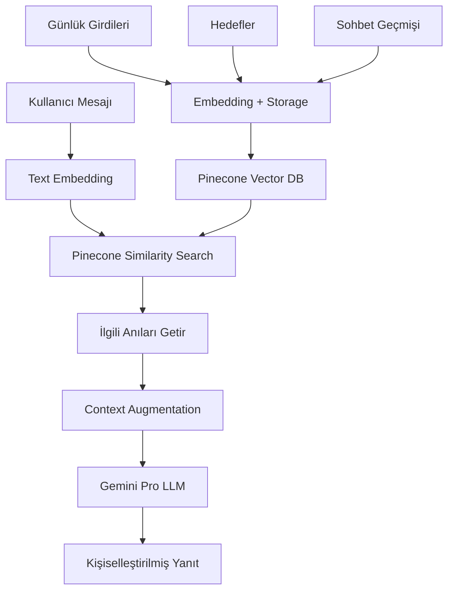

# MyMindMate - Kişisel Yapay Zeka Yoldaşınız

<div align="center">

[](https://python.org)
[](https://streamlit.io)
[](https://deepmind.google/technologies/gemini/)
[](https://firebase.google.com)
[](https://www.pinecone.io)

</div>

MyMindMate, zihinsel sağlığınızı desteklemek, düşüncelerinizi organize etmek ve hedeflerinize ulaşmanıza yardımcı olmak için tasarlanmış kişisel yapay zeka yoldaşınız. Kendisi sadece bir sohbet botu değil, aynı zamanda günlük tutabileceğiniz, hedefler belirleyebileceğiniz ve bu süreçte sizi daha iyi tanıyan bir arkadaştır.

## 📚 İçindekiler

- [Temel Özellikler](#-temel-özellikler)
- [Yapay Zeka Mimarisi](#-yapay-zeka-mimarisi-rag-akışı)
- [Teknoloji Stack'i](#️-kullanılan-teknolojiler-tech-stack)
- [Kurulum](#️-kurulum-ve-çalıştırma)
- [Kullanım](#-kullanım)
- [Katkıda Bulunma](#-katkıda-bulunma)
- [Lisans](#-lisans)

## 🚀 Temel Özellikler

- **🧠 RAG Destekli Hafıza:** Sadece bir sohbet botu değil, **Retrieval-Augmented Generation (RAG)** mimarisi kullanarak geçmiş konuşmaları, günlükleri ve hedefleri hatırlar. Bu sayede standart LLM'lerin çok ötesinde, derinlemesine bağlamsal ve kişisel bir sohbet deneyimi sunar.
- **📘 Kişisel Günlük:** Düşüncelerinizi ve duygularınızı güvenli bir ortamda kaydedin. Bu veriler, RAG mimarisi için bir bilgi kaynağı olarak kullanılır.
- **🎯 Hedef Yönetimi:** Günlük ve uzun vadeli hedefler belirleyin. AI, bu hedefleri anlayarak size proaktif olarak destek olabilir.
- **🤖 Kişiselleştirilmiş Yapay Zeka:** Girdiğiniz günlük ve hedefleri periyodik olarak analiz ederek sizi daha derinlemesine anlar ve daha empatik, kişiselleştirilmiş öneriler sunar.
- **🔐 Güvenli ve Özel:** Tüm verileriniz Firebase üzerinde güvenli bir şekilde saklanır ve kimlik doğrulama ile korunur. Verileriniz size özeldir.

## 🤖 Yapay Zeka Mimarisi: RAG Akışı

Bu projenin zekası, standart bir LLM çağrısından daha fazlasıdır. Kullanıcıya özel, kalıcı bir hafıza oluşturmak için **Retrieval-Augmented Generation (RAG)** deseni uygulanmıştır.

### Sistem Akış Diyagramı



### İşleyiş Adımları

1. **Veri Kaynakları ve Gömme (Embedding):**
   - Kullanıcının sohbet mesajları, günlük girdileri ve hedefleri gibi metin verileri, anlamsal anlamlarını yakalamak için Google'ın `embedding-001` modeli kullanılarak vektörlere (embeddings) dönüştürülür.

2. **Vektör Depolama (Vector Storage):**
   - Oluşturulan bu vektörler, orijinal metinle birlikte **Pinecone** üzerinde çalışan bir vektör veritabanına kaydedilir. Pinecone, yüksek hızda anlamsal benzerlik araması yapmak için optimize edilmiştir. Bu, yapay zekanın "uzun süreli hafızasını" oluşturur.

3. **Anlamsal Arama (Retrieval):**
   - Kullanıcı yeni bir mesaj gönderdiğinde, bu mesaj da anlık olarak bir vektöre dönüştürülür.
   - Ardından, Pinecone veritabanında bu yeni mesaja anlamsal olarak en çok benzeyen geçmiş kayıtları (en ilgili "hatıraları") bulmak için bir benzerlik araması (similarity search) yapılır.

4. **Bağlam Zenginleştirme (Augmentation):**
   - Bulunan en ilgili "hatıralar", kullanıcının asıl mesajıyla birleştirilerek zenginleştirilmiş bir bağlam (context) oluşturulur.

5. **Yanıt Üretimi (Generation):**
   - Bu zenginleştirilmiş bağlam, nihai yanıtı üretmesi için **Google Gemini Pro** modeline bir `prompt` olarak gönderilir. Bu sayede model, sadece son mesaja değil, aynı zamanda geçmişteki en alakalı bilgilere de dayanarak bir yanıt üretir.

Bu mimari, yapay zekanın sizi gerçekten "tanımasını" ve zamanla daha akıllı, daha kişisel bir yoldaş haline gelmesini sağlar.

## 🛠️ Kullanılan Teknolojiler (Tech Stack)

### Frontend & Backend
- **Framework:** [Streamlit](https://streamlit.io/) - Hızlı ve modern web uygulaması geliştirme
- **Programlama Dili:** [Python 3.8+](https://www.python.org/)

### Yapay Zeka & Machine Learning
- **Ana LLM:** [Google Gemini Pro](https://deepmind.google/technologies/gemini/) - Zenginleştirilmiş prompt'ları işleyerek nihai yanıt üretimi
- **Embedding Modeli:** [Google Text Embedding 001](https://ai.google.dev/docs/embeddings_guide) - Metinleri anlamsal vektörlere dönüştürme

### Veritabanı & Depolama
- **Kimlik Doğrulama:** [Firebase Authentication](https://firebase.google.com/products/auth)
- **Yapısal Veri:** [Firebase Realtime Database](https://firebase.google.com/products/realtime-database) - Kullanıcı profilleri, günlükler ve hedefler
- **Vektör Veritabanı:** [Pinecone](https://www.pinecone.io/) - RAG mimarisinin kalbi, anlamsal arama motoru

## 📂 Proje Yapısı

```
my_mindmate/
├── ai/
│   └── gemini_client.py
├── core/
│   ├── analysis_engine.py
│   ├── firebase_auth.py
│   ├── firebase_config.py
│   ├── firebase_db.py
│   └── memory.py
├── pages/
│   ├── 0_👋_Hoşgeldin.py
│   ├── 0_🔐_Kullanıcı_Girişi.py
│   ├── 1_🏠_Ana_Sayfa.py
│   ├── 2_💬_Sohbet.py
│   ├── 3_📘_Günlüğüm.py
│   ├── 4_🎯_Hedeflerim.py
│   └── 5_⚙️_Ayarlar.py
├── utils/
│   └── style.py
├── app.py
├── requirements.txt
└── README.md
```

## ⚙️ Kurulum ve Çalıştırma

### Önkoşullar

- Python 3.8 veya üzeri
- Git
- Google Cloud hesabı (Gemini API için)
- Firebase hesabı
- Pinecone hesabı

### 1. Projeyi Klonlayın

```bash
git clone https://github.com/omermsd/MyMindMate.git
cd MyMindMate
```

### 2. Sanal Ortam Oluşturun ve Aktive Edin

**Windows:**
```bash
python -m venv venv
venv\Scripts\activate
```

**macOS/Linux:**
```bash
python3 -m venv venv
source venv/bin/activate
```

### 3. Bağımlılıkları Yükleyin

```bash
pip install -r requirements.txt
```

### 4. API Anahtarlarını Yapılandırın

Projenizi klonladıktan sonra kök dizinde `.streamlit` klasörünün hazır geldiğini göreceksiniz. Yapmanız gereken tek şey, bu klasörün içine `secrets.toml` adında bir dosya oluşturmaktır.

Aşağıdaki komutla dosyayı oluşturabilirsiniz:

```bash
touch .streamlit/secrets.toml
```

`.streamlit/secrets.toml` dosyasını aşağıdaki şablonla doldurun:

```toml
# .streamlit/secrets.toml

[google]
api_key = "YOUR_GEMINI_API_KEY"

[firebase]
apiKey = "YOUR_FIREBASE_API_KEY"
authDomain = "YOUR_PROJECT.firebaseapp.com"
projectId = "YOUR_PROJECT_ID"
storageBucket = "YOUR_PROJECT.appspot.com"
messagingSenderId = "YOUR_SENDER_ID"
appId = "YOUR_APP_ID"
databaseURL = "https://YOUR_PROJECT-default-rtdb.firebaseio.com/"

[pinecone]
api_key = "YOUR_PINECONE_API_KEY"
```

### 5. API Anahtarlarını Alma

<details>
<summary><b>🔑 Google Gemini API Anahtarı</b></summary>

1. [Google AI Studio](https://makersuite.google.com/app/apikey)'ya gidin
2. "Create API Key" butonuna tıklayın
3. Anahtarınızı kopyalayın ve `secrets.toml`'e ekleyin

</details>

<details>
<summary><b>🔥 Firebase Yapılandırması</b></summary>

1. [Firebase Console](https://console.firebase.google.com/)'a gidin
2. "Add project" ile yeni proje oluşturun
3. Authentication ve Realtime Database'i etkinleştirin
4. Project Settings > General'dan config bilgilerini alın

</details>

<details>
<summary><b>🌲 Pinecone Kurulumu</b></summary>

1. [Pinecone](https://www.pinecone.io/)'da hesap oluşturun
2. API anahtarınızı alın
3. **Not:** Index otomatik olarak oluşturulacaktır. Manuel index oluşturmanıza gerek yoktur.

</details>

### 6. Uygulamayı Başlatın

```bash
streamlit run app.py
```

## 🎯 Kullanım

### İlk Kurulum

1. **Hesap Oluşturun:** Güvenli Firebase Authentication ile kayıt olun
2. **Profil Bilgilerinizi Girin:** Kişisel tercihlerinizi belirtin
3. **İlk Günlük Girisinizi Yapın:** AI'nın sizi tanıması için
4. **Hedeflerinizi Belirleyin:** Kısa ve uzun vadeli amaçlarınızı kaydedin

### Günlük Kullanım

- **🌅 Sabah:** Günlük hedeflerinizi gözden geçirin
- **📝 Gün İçinde:** Düşüncelerinizi günlüğe kaydedin  
- **💭 Her Zaman:** AI ile sohbet ederek destek alın
- **🌙 Akşam:** Günü değerlendirin ve yarın için plan yapın

## 🤝 Katkıda Bulunma

MyMindMate açık kaynak bir projedir ve ilgilenip katkıda bulunursanız çok sevinirim!

### Nasıl Katkıda Bulunabilirim?

1. **Fork** edin
2. Feature branch oluşturun (`git checkout -b feature/YeniOzellik`)
3. Değişikliklerinizi commit edin (`git commit -m 'Yeni özellik eklendi'`)
4. Branch'inizi push edin (`git push origin feature/YeniOzellik`)
5. **Pull Request** oluşturun

## 📄 Lisans

Bu proje, açık kaynak topluluğunun kullanımına sunulmuştur. Lütfen kaynak göstererek kullanınız. 💌

## 📞 İletişim & Destek

- **Geliştirici:** [@dilsahelmaci](https://github.com/dilsahelmaci)
- **Issues & Hata Bildirimi:** [GitHub Issues](https://github.com/dilsahelmaci/MyMindMate/issues)

---

<div align="center">

</div>